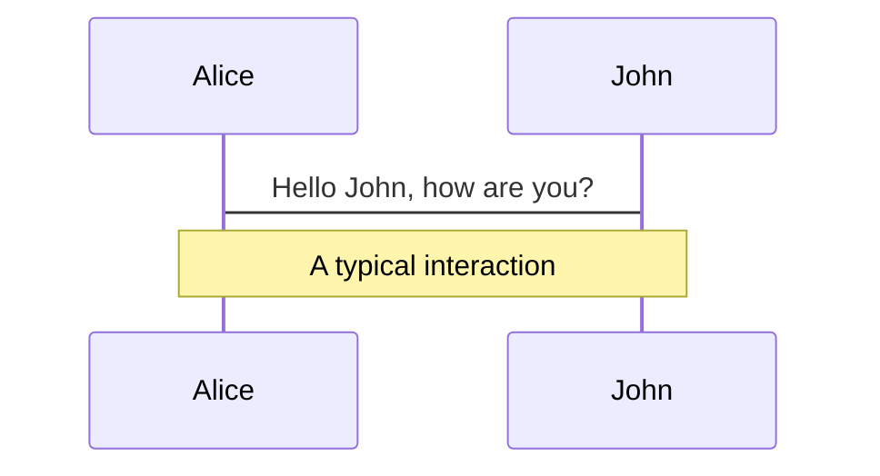
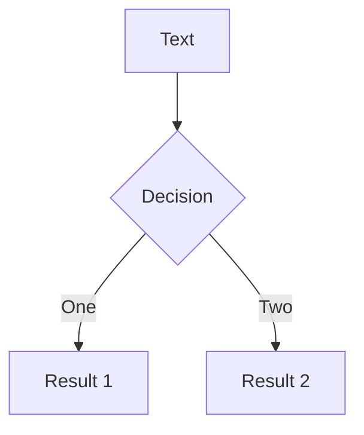

# Slidev Demo

Welcome to Slidev Demo Presentation

<div class="uppercase text-sm tracking-widest">
<Marker text="Presenter:" /> <Marker text="Sheing Ng" />
</div>

<div class="abs-bl mx-14 my-12 flex">
  
  <div class="ml-3 flex flex-col text-left">
    <div><b>Conga</b></div>
    <div class="text-sm opacity-50">June. 21th, 2021</div>
  </div>
</div>

---

# What is Slidev?

Slidev is a slides maker and presenter designed for developers, consist of the following features

- 📝 **Text-based** - focus on the content with Markdown, and then style them later
- 🎨 **Themable** - theme can be shared and used with npm packages
- 🧑‍💻 **Developer Friendly** - code highlighting, live coding with autocompletion
- 🤹 **Interactive** - embedding Vue components to enhance your expressions
- 🎥 **Recording** - built-in recording and camera view
- 📤 **Portable** - export into PDF, PNGs, or even a hostable SPA
- 🛠 **Hackable** - anything possible on a webpage

<br>
<br>

Read more about [Why Slidev?](https://sli.dev/guide/why)

<!--
You can have `style` tag in markdown to override the style for the current page.
Learn more: https://sli.dev/guide/syntax#embedded-styles
-->

<style>
h1 {
  background-color: #2B90B6;
  background-image: linear-gradient(45deg, #4EC5D4 10%, #146b8c 20%);
  background-size: 100%;
  -webkit-background-clip: text;
  -moz-background-clip: text;
  -webkit-text-fill-color: transparent; 
  -moz-text-fill-color: transparent;
}
</style>

---

# Navigation

Hover on the bottom-left corner to see the navigation's controls panel, [learn more](https://sli.dev/guide/navigation.html)

### Keyboard Shortcuts

|     |     |
| --- | --- |
| <kbd>right</kbd> / <kbd>space</kbd>| next animation or slide |
| <kbd>left</kbd>  / <kbd>shift</kbd><kbd>space</kbd> | previous animation or slide |
| <kbd>up</kbd> | previous slide |
| <kbd>down</kbd> | next slide |

<!-- https://sli.dev/guide/animations.html#click-animations -->

<p v-after class="absolute bottom-23 left-45 opacity-30 transform -rotate-10">Here!</p>


---
layout: image-right
image: https://media.glassdoor.com/l/88/ba/c5/26/working-in-the-hq-hub.jpg
---

# Code

Use code snippets and get the highlighting directly!

<!-- https://sli.dev/guide/syntax.html#line-highlighting -->

```ts {all|2|1-6|9|all}
interface User {
  id: number
  firstName: string
  lastName: string
  role: string
}

function updateUser(id: number, update: User) {
  const user = getUser(id)
  const newUser = {...user, ...update}  
  saveUser(id, newUser)
}
```

<arrow v-click="3" x1="400" y1="420" x2="230" y2="330" color="#564" width="3" arrowSize="1" />

---

# Components

<span grid="~ cols-3 gap-4">
<div>

You can use Vue components directly inside your slides.

We have provided a few built-in components like `<Tweet/>` and `<Youtube/>` that you can use directly. And adding your custom components is also super easy.

```html
<Counter :count="10" />
```

<!-- ./components/Counter.vue -->
<Counter :count="10" m="t-4" />

Check out [the guides](https://sli.dev/builtin/components.html) for more.

</div>

<div>

```html
<Tweet id="1405888082906394630" />
```

<Tweet id="1405888082906394630"  />

</div>

<!-- <div>


</div> -->

<div>

```html
<Spotify id="3KkXRkHbMCARz0aVfE" />
```

<Spotify id="3KkXRkHbMCARz0aVfEt68P" height="80"/>


```html
<Youtube id="BB8vCULwAuw" />
```

<Youtube id="BB8vCULwAuw" height="300"/>
</div>
</span>


---
class: px-20
---

# Demo Component TailwindCSS
Mac Terminal compoennt build with TailwindCSS 

<div class="pt-12">
  <MacTerminal />
</div>

Or, maybe Command Prompt?
---

# Demo Component TailwindCSS

Command Prompt component build with TailwindCSS 

<div class="pt-12">
  <CommandPrompt />
</div>


Or, maybe Macbook OS?
---

# Demo Iframe
    
   <iframe
      className="h-full w-full bg-vscode"
      src="https://portfolio.zxh.io/"
      frameBorder="0"
      title="VSCode"
    />

---

# Demo Vue3 Component from Library
    
   <NaiveUI />

<!--
<template>
   <n-calendar @update:value="handleUpdateValue" #="{ year, month, date }">
    {{ year }}-{{ month }}-{{ date }}
  </n-calendar>
</template>

<script setup>
import { NCalendar} from 'naive-ui'
</script>
-->

---

# Themes

Slidev comes with powerful theming support. Themes can provide styles, layouts, components, or even configurations for tools. Switching between themes by just **one edit** in your frontmatter:

<div grid="~ cols-2 gap-2" m="-t-2">

```yaml
---
theme: default
---
```

```yaml
---
theme: seriph
---
```


</div>

Read more about [How to use a theme](https://sli.dev/themes/use.html) and
check out the [Awesome Themes Gallery](https://sli.dev/themes/gallery.html).

---
preload: false
---

# Animations

Animations are powered by [@vueuse/motion](https://motion.vueuse.org/).

```html
<div
  v-motion
  :initial="{ x: -80 }"
  :enter="{ x: 0 }">
  Slidev
</div>
```

<div class="w-60 relative mt-6">
  <div class="relative w-40 h-40">
    
    
    
  </div>

  <div 
    class="text-5xl absolute top-14 left-40 text-[#2B90B6] -z-1"
    v-motion
    :initial="{ x: -80, opacity: 0}"
    :enter="{ x: 0, opacity: 1, transition: { delay: 2000, duration: 1000 } }">
    Slidev
  </div>
</div>

<!-- vue script setup scripts can be directly used in markdown, and will only affects current page -->
<script setup lang="ts">
const final = {
  x: 0,
  y: 0,
  rotate: 0,
  scale: 1,
  transition: {
    type: 'spring',
    damping: 10,
    stiffness: 20,
    mass: 2
  }
}
</script>

<div
  v-motion
  :initial="{ x:35, y: 40, opacity: 0}"
  :enter="{ y: 0, opacity: 1, transition: { delay: 3500 } }">

[Learn More](https://sli.dev/guide/animations.html#motion)

</div>

---

# LaTeX

LaTeX is supported out-of-box powered by [KaTeX](https://katex.org/).

<br>

Inline $\sqrt{3x-1}+(1+x)^2$

Block
$$
\begin{array}{c}

\nabla \times \vec{\mathbf{B}} -\, \frac1c\, \frac{\partial\vec{\mathbf{E}}}{\partial t} &
= \frac{4\pi}{c}\vec{\mathbf{j}}    \nabla \cdot \vec{\mathbf{E}} & = 4 \pi \rho \\

\nabla \times \vec{\mathbf{E}}\, +\, \frac1c\, \frac{\partial\vec{\mathbf{B}}}{\partial t} & = \vec{\mathbf{0}} \\

\nabla \cdot \vec{\mathbf{B}} & = 0

\end{array}
$$

<br>

[Learn more](https://sli.dev/guide/syntax#latex)

---

# Diagrams

You can create diagrams / graphs from textual descriptions, directly in your Markdown.

<div class="grid grid-cols-2 gap-10 pt-4 -mb-6">





</div>

[Learn More](https://sli.dev/guide/syntax.html#diagrams)


---
layout: center
class: text-center
---
# The End 

[Documentations](https://sli.dev) / [GitHub Repo](https://github.com/slidevjs/slidev)
